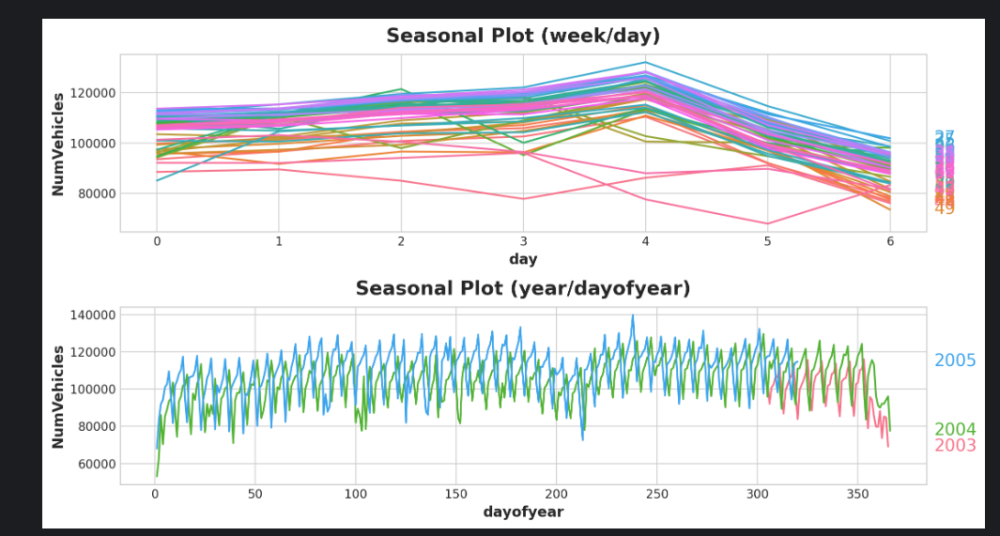
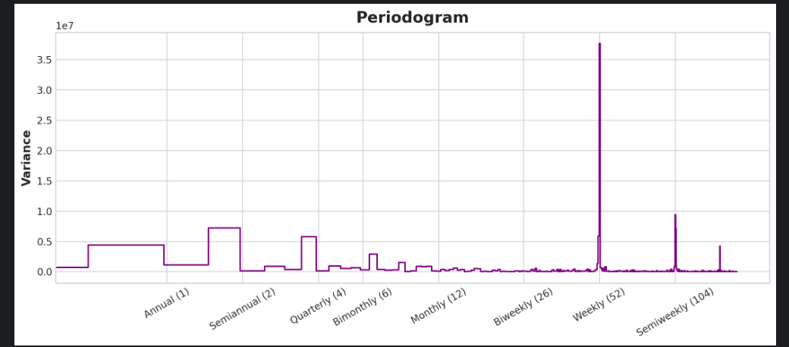
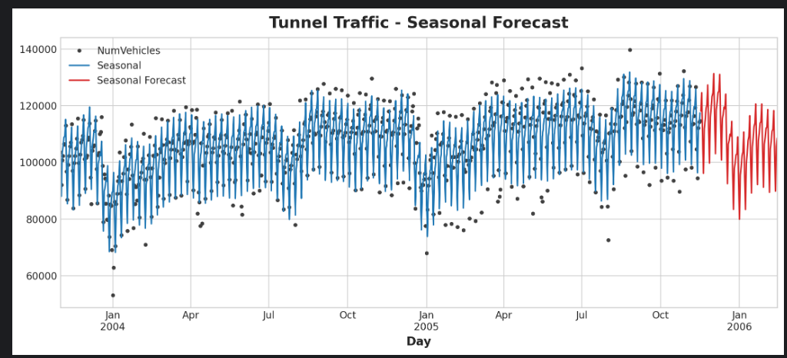
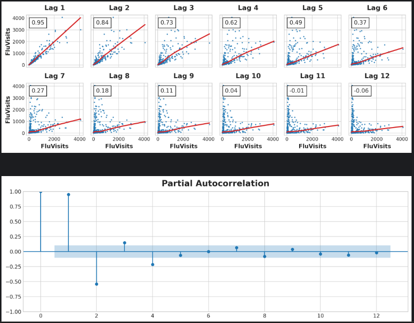

# Skrót

jak jest sezonowść przykłąd co styczeń, w tygodniu górka w weekend dołek to rozdział 3
jak są górki dołki ale nie sezonowo (jak rosło wczoraj to dzis też urośnie to rozdział 4)


# Rozdział pierwszy
---
***
___
po pierwsze ta regresja to aproksymacja

warto jest zrobić shifta wartość X o 1np. i sprawdzić jak to działa na wartości porpzednie nie wiem czy to po prostu nie jest korelacja 
przykład
{
    df['Lag_1'] = df['NumVehicles'].shift(1)
    df.head()
    from sklearn.linear_model import LinearRegression

    X = df.loc[:, ['Lag_1']]
    X.dropna(inplace=True)  # drop missing values in the feature set
    y = df.loc[:, 'NumVehicles']  # create the target
    y, X = y.align(X, join='inner')  # drop corresponding values in target

    model = LinearRegression()
    model.fit(X, y)

    y_pred = pd.Series(model.predict(X), index=X.index)
    fig, ax = plt.subplots()
    ax.plot(X['Lag_1'], y, '.', color='0.25')
    ax.plot(X['Lag_1'], y_pred)
    ax.set_aspect('equal')
    ax.set_ylabel('NumVehicles')
    ax.set_xlabel('Lag_1')
    ax.set_title('Lag Plot of Tunnel Traffic');
    
    # no jezeli krzywa rosnie no to mozemy dojsc do wniosku że wartość porpzednia wpływa an wartość przewidywaną że jak tata rosła to ta też rośnie
}


# Rozdział drugi

---
***
___


jak masz wykres to sprawdz jak wygląda krzywa z wartościami średnimi bo moze byc ze regresja liniowa typu ax+b jest dobra a moze ax**2 +bx+c będzie lepsza 
także warto to sprawdzić
{
    moving_average = tunnel.rolling(
        window=365,       # 365-day window
        center=True,      # puts the average at the center of the window
        min_periods=183,  # choose about half the window size
    ).mean()              # compute the mean (could also do median, std, min, max, ...)

    ax = tunnel.plot(style=".", color="0.5")
    moving_average.plot(
        ax=ax, linewidth=3, title="Tunnel Traffic - 365-Day Moving Average", legend=False,
    );
}

jak już ustaliłeś to masz kolejny kod w którym za order wpisujesz jaki stopień wielomianu. to jest aproksymacja wiec nie zawsze im wyzej tym lepiej 
przyszlosc przewiduje

{
    from statsmodels.tsa.deterministic import DeterministicProcess
    
    dp = DeterministicProcess(
        index=tunnel.index,  # dates from the training data
        constant=True,       # dummy feature for the bias (y_intercept)  to nie do końca wiem o co chodzi ale ja rozumiem ze to robi kolumne która zawiera same 1 i przy tworzeniu tej aproksymacji będzie 1*ax**2 + 1*b*x+1*c nie rozumiem po co to ale ze niby coś tam daje
        order=1,             # the time dummy (trend) 
        drop=True,           # drop terms if necessary to avoid collinearity to nie wiem co to dropuje ze chyba jak jest wiele kolumn co maja wysoka korelajce to ze dropuje ale nie wiem
    )
    # `in_sample` creates features for the dates given in the `index` argument
    X = dp.in_sample()

    X.head()
    from sklearn.linear_model import LinearRegression

    y = tunnel["NumVehicles"]  # the target

    # The intercept is the same as the `const` feature from
    # DeterministicProcess. LinearRegression behaves badly with duplicated
    # features, so we need to be sure to exclude it here.
    model = LinearRegression(fit_intercept=False)
    model.fit(X, y)

    y_pred = pd.Series(model.predict(X), index=X.index)


    X = dp.out_of_sample(steps=30)

y_fore = pd.Series(model.predict(X), index=X.index)

y_fore.head()
}


# Rozdział trzeci

---
***
___
Tu masz kod na wykresy periodogramu i sezonowosci
{
    from pathlib import Path
    from warnings import simplefilter

    import matplotlib.pyplot as plt
    import pandas as pd
    import seaborn as sns
    from sklearn.linear_model import LinearRegression
    from statsmodels.tsa.deterministic import CalendarFourier, DeterministicProcess

    simplefilter("ignore")

    # Set Matplotlib defaults
    plt.style.use("seaborn-whitegrid")
    plt.rc("figure", autolayout=True, figsize=(11, 5))
    plt.rc(
        "axes",
        labelweight="bold",
        labelsize="large",
        titleweight="bold",
        titlesize=16,
        titlepad=10,
    )
    plot_params = dict(
        color="0.75",
        style=".-",
        markeredgecolor="0.25",
        markerfacecolor="0.25",
        legend=False,
    )
    %config InlineBackend.figure_format = 'retina'


    # annotations: https://stackoverflow.com/a/49238256/5769929
    def seasonal_plot(X, y, period, freq, ax=None):
        if ax is None:
            _, ax = plt.subplots()
        palette = sns.color_palette("husl", n_colors=X[period].nunique(),)
        ax = sns.lineplot(
            x=freq,
            y=y,
            hue=period,
            data=X,
            ci=False,
            ax=ax,
            palette=palette,
            legend=False,
        )
        ax.set_title(f"Seasonal Plot ({period}/{freq})")
        for line, name in zip(ax.lines, X[period].unique()):
            y_ = line.get_ydata()[-1]
            ax.annotate(
                name,
                xy=(1, y_),
                xytext=(6, 0),
                color=line.get_color(),
                xycoords=ax.get_yaxis_transform(),
                textcoords="offset points",
                size=14,
                va="center",
            )
        return ax


    def plot_periodogram(ts, detrend='linear', ax=None):
        from scipy.signal import periodogram
        fs = pd.Timedelta("365D") / pd.Timedelta("1D")
        freqencies, spectrum = periodogram(
            ts,
            fs=fs,
            detrend=detrend,
            window="boxcar",
            scaling='spectrum',
        )
        if ax is None:
            _, ax = plt.subplots()
        ax.step(freqencies, spectrum, color="purple")
        ax.set_xscale("log")
        ax.set_xticks([1, 2, 4, 6, 12, 26, 52, 104])
        ax.set_xticklabels(
            [
                "Annual (1)",
                "Semiannual (2)",
                "Quarterly (4)",
                "Bimonthly (6)",
                "Monthly (12)",
                "Biweekly (26)",
                "Weekly (52)",
                "Semiweekly (104)",
            ],
            rotation=30,
        )
        ax.ticklabel_format(axis="y", style="sci", scilimits=(0, 0))
        ax.set_ylabel("Variance")
        ax.set_title("Periodogram")
        return ax


    data_dir = Path("../input/ts-course-data")
    tunnel = pd.read_csv(data_dir / "tunnel.csv", parse_dates=["Day"])
    tunnel = tunnel.set_index("Day").to_period("D")
}


i robisz tak 

najpierw rysujesz aby sobie zwizualizować
{

    X = tunnel.copy()

    # days within a week
    X["day"] = X.index.dayofweek  # the x-axis (freq)
    X["week"] = X.index.week  # the seasonal period (period)

    # days within a year
    X["dayofyear"] = X.index.dayofyear
    X["year"] = X.index.year
    fig, (ax0, ax1) = plt.subplots(2, 1, figsize=(11, 6))
    seasonal_plot(X, y="NumVehicles", period="week", freq="day", ax=ax0)
    seasonal_plot(X, y="NumVehicles", period="year", freq="dayofyear", ax=ax1);
}


później wrzucasz se periodogram co wcześniej dałem do tego kod
plot_periodogram(tunnel.NumVehicles);

z wykresu widać że weekly bardzo dobrze dzaiła tak jak w sumie na wczesniejszym wykresie było widać i tu jest tak że sezonowość jest taka że w weekend zawsze spada a w tygodniu zawsze rośnie wiec tu nie korzystamy z furiera tylko prosty warunek taka w sumie nie regresja jak weekend to 0 jak w tygodniu to 1 na przykład
a do rocznego należy skorzystać z furiera i tutaj korzystajac z tego petrogramu miedzy 6 a 12 tak spada dość mocno wiec wybieramy 10
tutaj trzeba uważać żeby nie za dużo bo przeuczenie

wiec tworzymy furiera z 10, jeżeli chcielibyśmy nie roczne a półroczne to wzielibyśmy 5 chyba dla kwartału 10/4 wiec albo 2 albo 3 tylko ważne w tworzeniu tego furiera inną freq bierzesz A-annual SA-semiaanual
Tutaj też w tym deterministic process jak masz ten season to gerneralnie ten index=y.index działa tak że algorytm wie że np. jet to co dzień index wiec sezonowosć będzie co 7 dni co weekend jeżeli byś miał week to byś miał sezonowosć 52 week, jak miesiac to 12 miesiecy 
{
    from statsmodels.tsa.deterministic import CalendarFourier, DeterministicProcess

    fourier = CalendarFourier(freq="A", order=10)  # 10 sin/cos pairs for "A"nnual seasonality

    dp = DeterministicProcess(
        index=tunnel.index,
        constant=True,               # dummy feature for bias (y-intercept)
        order=1,                     # trend (order 1 means linear)
        seasonal=True,               # weekly seasonality (indicators)
        additional_terms=[fourier],  # annual seasonality (fourier)
        drop=True,                   # drop terms to avoid collinearity
    )

    X = dp.in_sample()  # create features for dates in tunnel.index

}

na końcu ostateczna wizualizacja

{

    y = tunnel["NumVehicles"]

    model = LinearRegression(fit_intercept=False)
    _ = model.fit(X, y)

    y_pred = pd.Series(model.predict(X), index=y.index)
    X_fore = dp.out_of_sample(steps=90)
    y_fore = pd.Series(model.predict(X_fore), index=X_fore.index)

    ax = y.plot(color='0.25', style='.', title="Tunnel Traffic - Seasonal Forecast")
    ax = y_pred.plot(ax=ax, label="Seasonal")
    ax = y_fore.plot(ax=ax, label="Seasonal Forecast", color='C3')
    _ = ax.legend()

}





# Rozdział 4

może być sytuacja że są górki i dołki ejst jakiś wzór ale nie sezowonowć
wtedy "robisz" kolumny lag 1 lag2 ... gdzie każda kolumna to w wierszu X jest ta wartość co na poczaktu była i masz wykres wartość teraźniejsza do wartości 1/2/3... w przeszłośc możesz zobaczyć korelacje 

kod na te wykresy 
{
    _ = plot_lags(flu_trends.FluVisits, lags=12, nrows=2)
_ = plot_pacf(flu_trends.FluVisits, lags=12)
} 




z zdjecia wynika że 1 2 3 4 spoko reszta nie wiec wybieram te 4
to co jest na górnym i dolnym wykresie to co innego bodajrze dolny sprawdza wpły lag X do teraźniejszosci i bierze również lagi od X do teraźniejszości górny to bezpośrendnio teraźniejszość ~ lagX
kod do tworzenia tych opóźnień i nandy na 0 zmiana
{
    def make_lags(ts, lags):
    return pd.concat(
        {
            f'y_lag_{i}': ts.shift(i)
            for i in range(1, lags + 1)
        },
        axis=1)


X = make_lags(flu_trends.FluVisits, lags=4)
X = X.fillna(0.0)
}


 Po tym możesz przystąpić do predykcji i innych

{
        # Create target series and data splits
    y = flu_trends.FluVisits.copy()
    X_train, X_test, y_train, y_test = train_test_split(X, y, test_size=60, shuffle=False)

    # Fit and predict
    model = LinearRegression()  # `fit_intercept=True` since we didn't use DeterministicProcess
    model.fit(X_train, y_train)
    y_pred = pd.Series(model.predict(X_train), index=y_train.index)
    y_fore = pd.Series(model.predict(X_test), index=y_test.index)
    ax = y_train.plot(**plot_params)
    ax = y_test.plot(**plot_params)
    ax = y_pred.plot(ax=ax)
    _ = y_fore.plot(ax=ax, color='C3')
    ax = y_test.plot(**plot_params)
_ = y_fore.plot(ax=ax, color='C3')
}

 
 W tym przypadku jeżeli w google trends też jest wyszukiwane słowo flu to prawdopodobnie to będzie jakas epidemia czy coś wstawiam kod jak się bawić z tym trendem
```python
{
search_terms = ["FluContagious", "FluCough", "FluFever", "InfluenzaA", "TreatFlu", "IHaveTheFlu", "OverTheCounterFlu", "HowLongFlu"]

# Create three lags for each search term
X0 = make_lags(flu_trends[search_terms], lags=3)
X0.columns = [' '.join(col).strip() for col in X0.columns.values]

# Create four lags for the target, as before
X1 = make_lags(flu_trends['FluVisits'], lags=4)

# Combine to create the training data
X = pd.concat([X0, X1], axis=1).fillna(0.0)
}
```


```python
{X_train, X_test, y_train, y_test = train_test_split(X, y, test_size=60, shuffle=False)

model = LinearRegression()
model.fit(X_train, y_train)
y_pred = pd.Series(model.predict(X_train), index=y_train.index)
y_fore = pd.Series(model.predict(X_test), index=y_test.index)

ax = y_test.plot(**plot_params)
_ = y_fore.plot(ax=ax, color='C3')}

```


